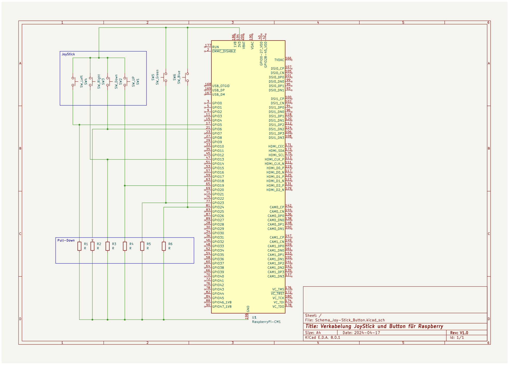

= Projekt Dokumentation

Willkommen zur Dokumentation unseres Projekts. Diese Dokumentation umfasst:

- Softwaredokumentation (SAD)
- Hardware-Dokumentation
- Testdokumentation
- Programmierkonventionen

Alle Dokumente sind im AsciiDoc-Format geschrieben. Weitere Informationen zu AsciiDoc finden Sie hier:

- https://docs.asciidoctor.org/asciidoc/latest/[AsciiDoc-Dokumentation]
- https://www.informatik-aktuell.de/entwicklung/methoden/docs-as-code-die-grundlagen.html[Informatik Aktuell - Docs as Code]
- https://www.vogella.com/tutorials/AsciiDoc/article.html[Vogella AsciiDoc Tutorial]
- https://www.heise.de/hintergrund/Documentation-as-Code-mit-Asciidoctor-4642013.html[Heise - Documentation as Code]
- https://blogs.uni-bremen.de/studytools/2021/09/11/projekte-dokumentierenmit-asciidoc/[Projekt Dokumentation mit AsciiDoc]

== Inhaltsverzeichnis

1. xref:/software(sad)[Softwaredokumentation]
2. xref:/hardware[Hardware-Dokumentation]
3. xref:/testing[Testdokumentation]
4. xref:coding_conventions.adoc[Programmierkonventionen]

== Softwaredokumentation

Die Softwaredokumentation folgt den Vorgaben von https://arc42.org/[arc42]. Der erste Schritt ist die Erstellung der xref:software/sad/system-idee.adoc[System-Idee].

== Hardware-Dokumentation

In der Hardware-Dokumentation finden Sie alle notwendigen Informationen zum Aufbau des Produkts.

=== Teileliste

- Raspberry Pi
- Micro SD-Karte, mindestens 16GB
- Purecrea Arcade Joystick 4-Weg (28.90 CHF)
- 2 Large Arcade Button, 60mm, beleuchtet (LED 12V DC) (3.60 CHF pro Stück)
- VT FSH-R-6,35 Flachsteckerhülse, Breite: 6.35mm, rot (0.09 CHF pro Stück)

=== Dateien

- link:files/RaspberryPI_Halter_v2.1.3mf.stl[RaspberryPi Halter v2.1.3mf]
- link:files/TV-Panel-Halter_v1.stl[TV-Panel-Halter v1]

== Testdokumentation

Die Testdokumentation beschreibt die durchgeführten Tests zur Überprüfung der Produktanforderungen.

=== Unit-Tests

Die Unit-Tests werden regelmässig ab dem Entstehungsdatum des Projekts durchgeführt. Eine genaue Dokumentation der Ausführungszeitpunkte ist nicht erforderlich. Die Testergebnisse und die überprüften Funktionen sind in den entsprechenden Testberichten festgehalten.

=== Manuelle Tests

Die manuellen Tests umfassen detaillierte Testprotokolle, die beschreiben, wann welche Prüfungen durchgeführt wurden und welche Ergebnisse erzielt wurden. Diese Protokolle enthalten spezifische Testfälle, die zu verschiedenen Testszenarien kombiniert werden können. Der abschliessende Abnahmetest, der die wichtigsten Anforderungen des Projekts überprüft, ist ebenfalls dokumentiert.

== Programmierkonventionen (Coding-Conventions)

Die Programmierkonventionen definieren die Regeln für die Codierung in diesem Projekt. Das Team hat sich an bestehenden Coding-Conventions orientiert und Massnahmen ergriffen, um sicherzustellen, dass diese Regeln eingehalten werden. Details zu den angewendeten Konventionen und den Überprüfungsverfahren sind in der Dokumentation beschrieben.
